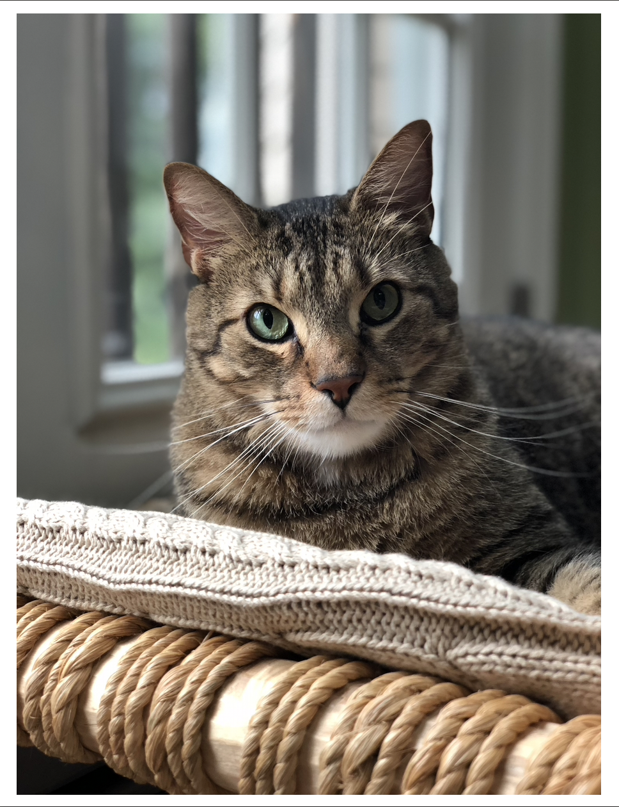
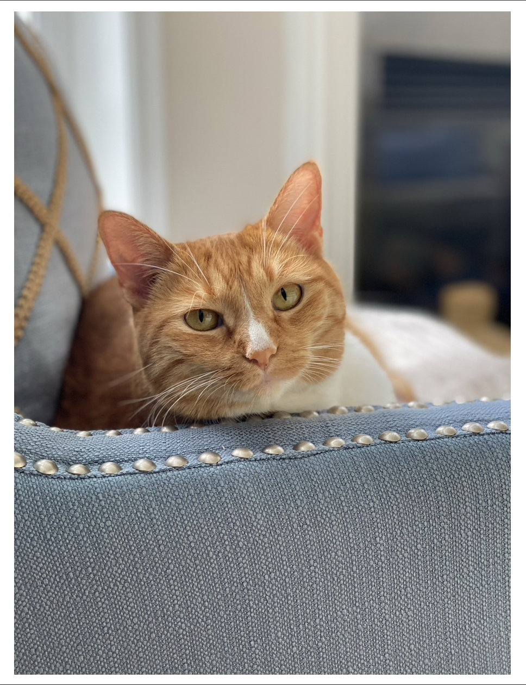
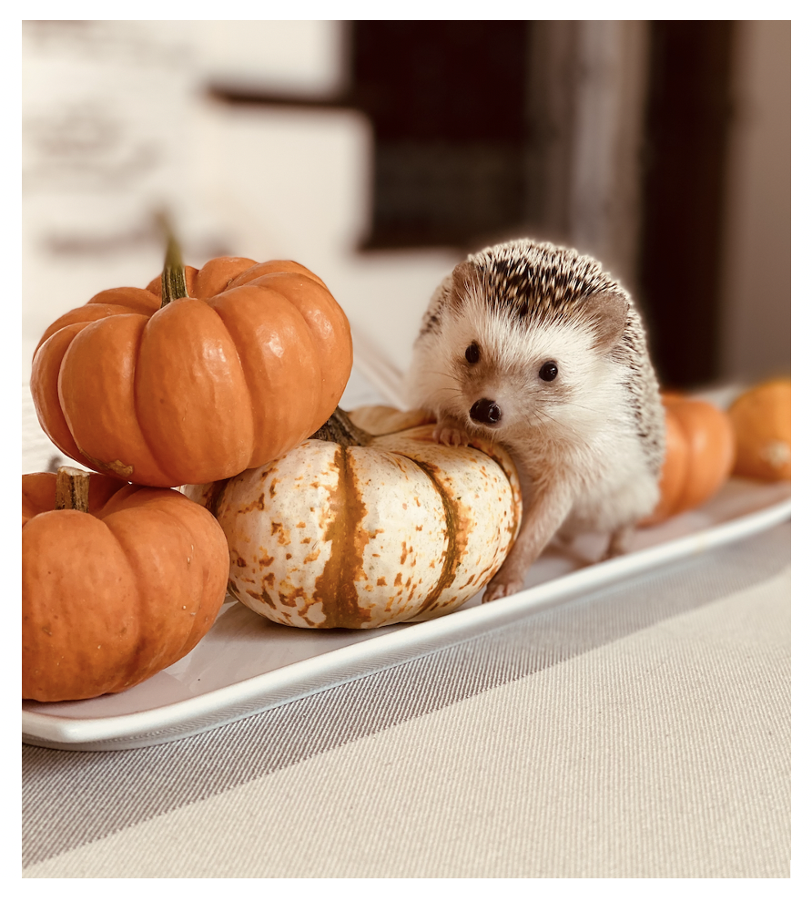

## Introduction 

Hi! Welcome to my humble website. My name is Zaynub and I am currently a second year MPH student at Columbia University. I am pursuing a degree in epidemiology with a concentration in global health and I am hoping to gain new coding and statistical analysis skills using R in my p8015 class that I can apply later in my budding career as an epidemiologist. 

Academics aside, some of my favorite activities include rock climbing, baking, drawing and bothering my pets. I have two cats, Jalinki and Misha, and one spiky little hedgehog named Sooji. I also love to travel and explore the outdoors. Some of my favorite adventures include hiking Mt. Kilimanjaro in Tanzania and hiking a glacier in the Himalayan mountains. 

## My pets

